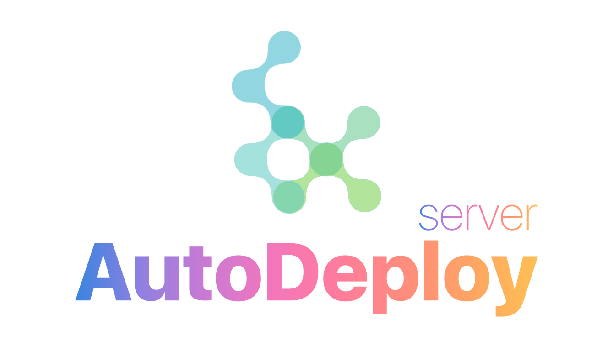

# Social

- Telegram: [@uxname](https://t.me/uxname)
- Mail: [uxname@gmail.com](mailto://uxname@gmail.com)
- Github: [@uxname](https://github.com/uxname)

# Open-source

## [LiteEnd](https://github.com/uxname/liteend)

Simple lightweight GraphQL server on Node.JS which can be used as a basis backend for a new projects. Prisma.io and
SQLite (postgres and others DBMS available too) uses as base for data storage.

## [LiteFront](https://github.com/uxname/litefront)

Next.js + GraphQL + Typescript frontend boilerplate.

## [Autodeploy server](https://github.com/uxname/autodeploy-server)

Simple server for autodeploy apps, written on Go

## [LikeLog](https://github.com/uxname/likelog)

Frontend logging framework for JavaScript

# Not open source projects

## [Brand Protocol](https://brandprotocol.net)

Ecosystem which uses blockchain to protect products or digital assets from counterfeiting.

## Remote medical examination system

- Hardware solution for measuring blood pressure, blood alcohol and body temperature.
- Terminal software for working with hardware. Based on linux.
- Backend solution to manage terminals. 
